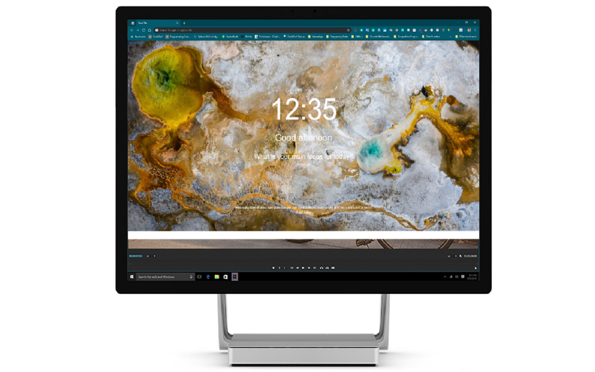
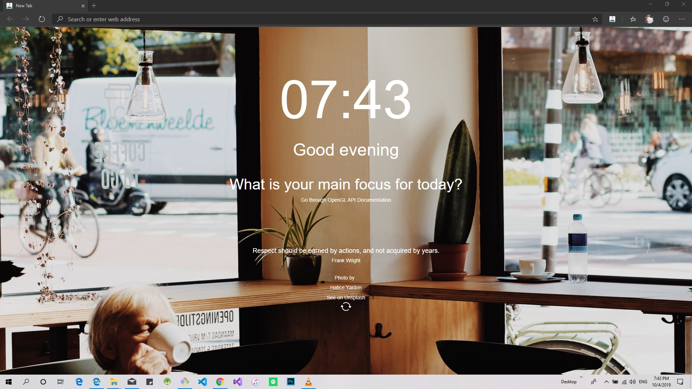

#   Achieve - Chrome Extension

## Achieve is a New Tab Chrome Extension. It delivers daily motivational quotes with beautiful images! That will surely motivate you to work

[](LICENSE)


[](https://twitter.com/intent/tweet?text=Wow:&url=https%3A%2F%2Fgithub.com%2Fpprathameshmore%2FAchieve-Chrome-Extension)


[Youtube Demo](https://www.youtube.com/watch?v=lZZXsh_7trY)

### Screenshots





## Dependencies

For Background Images [Unsplash API](https://github.com/unsplash/unsplash-js)<br>
For Quotes [QuoteGarden](https://github.com/pprathameshmore/QuoteGarden)

## Programming languages and Tools

1. Vanilla JavaScript
2. Visual Studio Code

## Getting Started

### Clone the repository locally

1. Clone the repository to your machine : `git clone https://github.com/pprathameshmore/Achieve-Chrome-Extension.git`

### Enable Extensions Developer Mode on Google Chrome

1. Navigate to [chrome://extensions/](chrome://extensions/).
2. Enable developer mode (Toggle button in right top corner).
3. Select `Load Unpacked` and browse and select the cloned repository folder.
4. Make sure that the extension is enabled.
5. Open a new tab in Chrome and you should see a splash screen with motivational quotes.

## Contributors

- [pprathameshmore](https://github.com/pprathameshmore)
- [ddazal](https://github.com/ddazal)
- [Ventrosky](https://github.com/Ventrosky)
- [rowhitswami](https://github.com/rowhitswami)
- [Tilak999](https://github.com/Tilak999)
- [ManuelOviedo](https://github.com/ManuelOviedo)
- [yordanzhelevdev](https://github.com/yordanzhelevdev)
- [thedeany](https://github.com/thedeany)
- [rokibulislaam](https://github.com/rokibulislaam)
- [alejandrotoga02](https://github.com/alejandrotoga02)
- [petr7555](https://github.com/petr7555)
- [ploh007](https://github.com/ploh007)
- [joshuafbarker](https://github.com/joshuafbarker)
- [geektutor](https://github.com/geektutor)
- [kiyominox](https://github.com/kiyominox)
- [alejandrotoga02](https://github.com/alejandrotoga02)
- [adityakmr7](https://github.com/adityakmr7)
- [am dominic nshimba](https://github.com/domitechnshimba)

## License

```
The MIT License (MIT)
=====================

Copyright © 2019 - 2020 Prathamesh More

Permission is hereby granted, free of charge, to any person obtaining a copy of this software and associated documentation
files (the “Software”), to deal in the Software without restriction, including without limitation the rights to use,
copy, modify, merge, publish, distribute, sublicense, and/or sell copies of the Software, and to permit persons to whom the
Software is furnished to do so, subject to the following conditions:

The above copyright notice and this permission notice shall be included in all copies or substantial portions of the Software.

THE SOFTWARE IS PROVIDED “AS IS”, WITHOUT WARRANTY OF ANY KIND, EXPRESS OR IMPLIED, INCLUDING BUT NOT LIMITED TO THE WARRANTIES
OF MERCHANTABILITY, FITNESS FOR A PARTICULAR PURPOSE AND NONINFRINGEMENT. IN NO EVENT SHALL THE AUTHORS OR COPYRIGHT
HOLDERS BE LIABLE FOR ANY CLAIM, DAMAGES OR OTHER LIABILITY, WHETHER IN AN ACTION OF CONTRACT, TORT OR OTHERWISE, ARISING FROM,
OUT OF OR IN CONNECTION WITH THE SOFTWARE OR THE USE OR
OTHER DEALINGS IN THE SOFTWARE.
```
